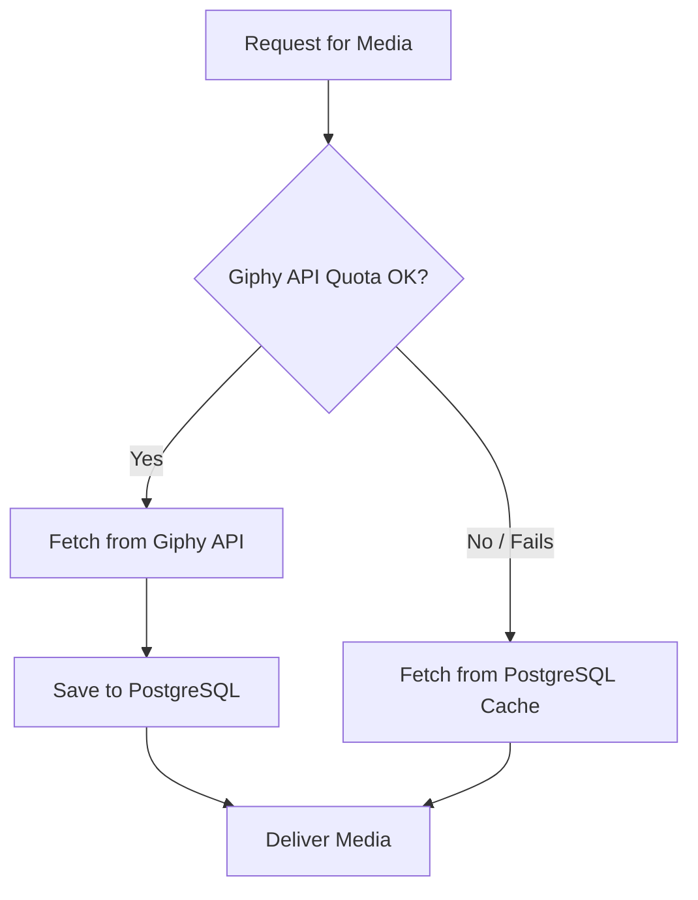

# Contextual Media Engine Architecture

This document explains the architecture of the **Contextual Media Engine** we built for the IPL WhatsApp Bot. You can use these exact patterns to build similar dynamic, context-aware, and highly resilient media delivery systems in ANY application (Discord bots, Slack integrations, automated reporting, etc).

## Core Problems Solved

1. **Repetitive Content**: Static pools of media quickly become boring. Using broad API searches (e.g., "celebration") usually pulls the same top 5 viral GIFs every time.
2. **Rate Limits**: Free APIs (like Giphy) typically have strict limits (e.g., 100 hits/hour). A busy app will easily exhaust this.
3. **Lack of Personalization Context**: A standard "wicket" GIF doesn't differentiate between a spectacular diving catch and a simple cleanly bowled stump.
4. **Lack of User Persona**: When user "Meet" does something, it should feel like Meet, not a generic user.

---

## 1. The Two-Layer Caching Architecture (Resilience)

To survive API rate limits while still building a massive pool of dynamic content, we use a two-layer Read-Through PostgreSQL Cache system.



**How it works in practice:**
* **Exploration Phase**: Every time the API works, you take the GIF URLs it gives you and save them to a shared PostgreSQL table (`gif_cache`), categorized by the query used.
* **Exploitation Phase (Fallback)**: When the API rate limit hits (`429 Too Many Requests`), the app silently catches the error and queries the `gif_cache` table for unseen GIFs under that same category.
* **Why this is powerful**: Over time, your application naturally builds its own massive, offline database of highly relevant GIFs. Other applications on the same server can connect to this same database to grab media without ever hitting the Giphy API.

### PostgreSQL Schema Setup
```sql
CREATE TABLE IF NOT EXISTS gif_cache (
    id          SERIAL PRIMARY KEY,
    giphy_id    TEXT NOT NULL UNIQUE,
    mp4_url     TEXT NOT NULL,
    category    TEXT NOT NULL,
    query_tag   TEXT NOT NULL,
    used_count  INT DEFAULT 0,
    last_used   TIMESTAMPTZ,
    created_at  TIMESTAMPTZ DEFAULT NOW()
);
CREATE INDEX IF NOT EXISTS idx_gif_cache_query ON gif_cache(query_tag);
```

---

## 2. The Sentiment Engine (Contextual Logic)

Instead of passing hardcoded category strings (like `"wicket"` or `"celebration"`), the system intercepts the raw live data properties and converts them into hyper-specific text queries. 

This is the **Sentiment Engine**.

**Concept**: Take numeric or categorical data from your app and translate it to emotional human text that Giphy understands.

**Example from Cricket**:
```python
def get_contextual_query(event_type, context=None):
    if event_type == "fifty":
        sr = context.get("sr", 0) # Strike Rate
        if sr > 180:
            return "violent hitting slog blitz"
        elif sr < 100:
            return "gritty innings relief exhausted"
        return "half century raise bat milestone"
        
    if event_type == "wicket_caught":
        sixes = context.get("sixes", 0)
        if sixes >= 2:
            return "caught in deep mistimed slog"
        return "brilliant catch slip diving"
```

**How to adapt this for other apps**:
* **E-commerce App**: If a user spends over $500 → query: `"making it rain money bags"`. If they abandon a cart → query: `"wait come back sad"`.
* **SaaS Dashboard**: Server CPU hits 99% → query: `"this is fine fire panic"`. Successful deployment → query: `"rocket launch success"`.

---

## 3. The Persona Engine (User-Specific Logic)

Different users have different personalities. If you know "Prashast" loves Formula 1 and "Vaishali" loves Taylor Swift, you can override the target search query based on who triggered the event.

```python
PERSONA_QUERIES = {
    "prashast": ["formula 1 overtake", "f1 podium champagne", "pit crew fast"],
    "vaishali": ["taylor swift surprised award", "taylor swift shake it off"],
    "nishant":  ["professional nod suits", "office win smug smile"],
}

def get_persona_media(user_name):
    name_lower = user_name.lower()
    for persona, queries in PERSONA_QUERIES.items():
        if persona in name_lower:
            return random.choice(queries) # Feed to Giphy API
    return None
```

---

## 4. Anti-Repeat Window & Deep Offset

Even with dynamic queries, Giphy will bias toward the same top 5 GIFs for a given search term. To fix this, you need two things: API offsets and Session State deduplication.

**A. Deep Offset**
Always randomize the `offset` parameter in your API calls to skip the overused top results.
```python
# Skip the top 5 most viral results, pick from somewhere in the next 200
offset = random.randint(5, 200) 
```

**B. Session State Deduplication (The "Seen" List)**
Keep a rolling window (e.g., 500 items) of media IDs that the bot has recently output.
```python
# In state.json or Redis
seen_ids = state.setdefault("seen_giphy_ids", [])

for gif in data_from_api:
    gif_id = gif["id"]
    if gif_id in seen_ids:
        continue # Skip! Already sent this recently.
    
    seen_ids.append(gif_id)
    # Keep rolling window tight
    if len(seen_ids) > 500:
        state["seen_giphy_ids"] = seen_ids[-400:]
    return gif["mp4"]
```

## Summary of Execution Flow
1. Event happens (e.g. User scores points).
2. App reads data Context + User Name.
3. **Persona Router**: Is there a persona match? If yes, `query = Taylor Swift`.
4. **Sentiment Router**: If no persona, map data to emotion. `query = violent bat blitz`.
5. **Giphy API**: Request with random `offset=84`.
6. **Anti-Repeat**: Filter results against `seen_ids`.
7. **Cache**: Insert newly found GIF into PostgreSQL DB.
8. **Fallback**: If step 5 fails, read from PostgreSQL `gif_cache` WHERE `query_tag = query`. 
9. Send GIF.
